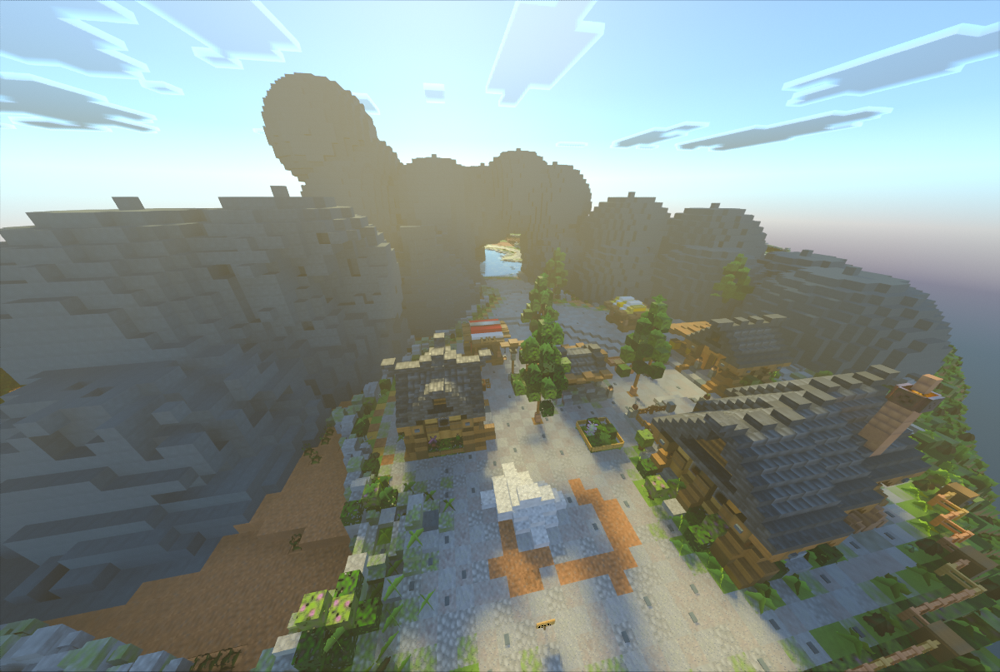

# 🪨 Minage Clasique

***

## <mark style="color:purple;">Le Minage sur Linesia</mark>

<mark style="color:purple;">**Linesia**</mark> est un environnement unique où l’exploration et le minage occupent une place centrale dans le développement stratégique des joueurs. Contrairement à d’autres modes de jeu, le minage ici ne se limite pas à récolter des ressources de manière passive ; il est au cœur de la progression.

### 1. <mark style="color:purple;">Les Différents Types de Minerais</mark>

Sur <mark style="color:purple;">Linesia</mark>, les minerais se présentent sous **deux formes distinctes :**&#x20;

* <mark style="color:purple;">**Les blocs de minerai classiques**</mark>\
  Ces minerais apparaissent directement sous forme de blocs dans le sol. Ils sont visibles et peuvent être minés avec des outils adaptés. Chaque bloc représente un minerai brut, prêt à être cuit et transformé en minerai utilisable pour améliorer son équipement. Les joueurs doivent souvent creuser stratégiquement pour les trouver, ce qui ajoute une difficulté au minage.

* <mark style="color:purple;">**Les minerais sous forme d’entités**</mark>\
  Contrairement aux blocs, certains minerais apparaissent comme des entités flottantes ou dispersées dans l’environnement. Ces entités ne sont pas simplement visibles au sol et nécessitent une approche différente pour être récoltées. Elles ajoutent un élément de surprise et de stratégie, car elles ont des points de vie contrairement aux blocs, incitant les joueurs à explorer activement et à planifier leurs déplacements.

### 2. <mark style="color:purple;">Le But du Minage</mark>

Le minage sur <mark style="color:purple;">Linesia</mark> ne consiste pas seulement à accumuler des ressources, il répond à plusieurs objectifs essentiels :

* <mark style="color:purple;">**Renforcer son équipement**</mark> : Les minerais permettent de fabriquer ou d’améliorer des armes, armures et outils. Dans un environnement compétitif, chaque amélioration peut faire la différence entre la victoire et la défaite.
* <mark style="color:purple;">**Accélérer sa progression**</mark> : Certaines ressources rares ne peuvent être obtenues qu’en minant. Elles offrent un avantage stratégique à ceux qui les collectent rapidement.
* <mark style="color:purple;">**Contrôler l’espace de jeu**</mark> : En exploitant les ressources d’une zone, un joueur peut limiter l’accès à ses adversaires, devenant ainsi un acteur majeur du territoire.
* <mark style="color:purple;">**Développer la stratégie**</mark> : Savoir quand et où miner, et choisir entre blocs visibles ou minerais sous forme d’entités, influence directement le rythme et l’efficacité de la partie.

### 3. <mark style="color:purple;">Stratégies de Minage</mark>

Pour tirer le meilleur parti de <mark style="color:purple;">Linesia</mark>, il est essentiel de combiner **observation, anticipation et rapidité** :

* **Explorer méthodiquement** : Identifier les zones riches en minerais et prévoir les itinéraires de collecte.
* **Prioriser les ressources rares** : Certaines entités ou blocs offrent des avantages disproportionnés et doivent être récoltés en priorité.
* **Optimiser le temps de minage** : Chaque seconde compte. Savoir alterner entre exploitation de blocs et capture d’entités permet d’accumuler un maximum de ressources rapidement.

***

<figure><figcaption></figcaption></figure>

***
