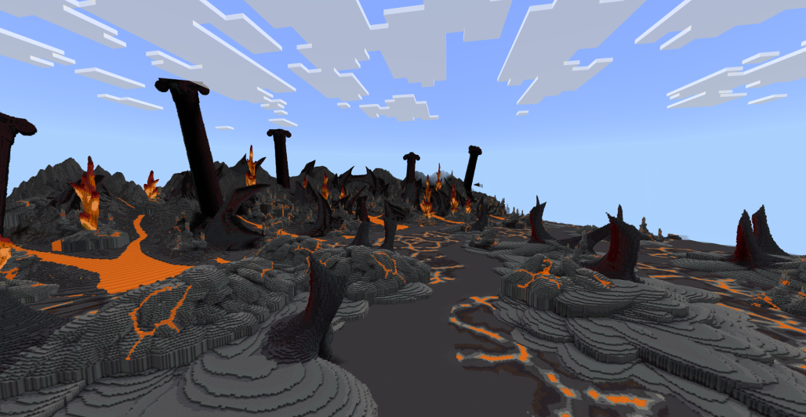

# 💧 Minage Glace

***

## <mark style="color:purple;background-color:purple;">Le Minage de Glace sur Linesia</mark>

<mark style="color:purple;">**Linesia**</mark> est un environnement unique où l’exploration et le minage occupent une place centrale dans le développement des joueurs.

### 1. <mark style="color:purple;">Les Différents Types de Ressources</mark>

Dans la **mine de glace** sur <mark style="color:purple;">Linesia</mark>, les ressources se présentent sous plusieurs formes distinctes :

<mark style="color:purple;">**Les blocs de glace et cristaux**</mark>\
Certains minerais apparaissent sous forme de blocs classiques, mais avec la particularité d’être accompagnés de **cristaux de glace**. Ces cristaux sont des ressources rares qui permettent d’améliorer certains équipements ou de fabriquer des objets uniques. Les blocs sont visibles et peuvent être minés avec des outils adaptés.

<mark style="color:purple;">**Les entités glaciales**</mark>\
En plus des blocs, certaines ressources apparaissent comme des **entités flottantes ou dispersées** dans la mine. Ces entités ont des points de vie et nécessitent d’être vaincues pour  récolter ses ressources.&#x20;

<mark style="color:purple;">Les Monstres de Glace</mark>

Dans ce minage, vous devrez faire attention et venir avec votre meilleur équipement ! Car la grotte grouille de différents monstres plus ou moins puissant qui vous attaqueront durant votre séance de minage !

#### 2. <mark style="color:purple;">Le But de la Mine</mark>

Le minage de glace sur <mark style="color:purple;">Linesia</mark> ne consiste pas seulement à accumuler des ressources ; il répond à plusieurs objectifs stratégiques :

* <mark style="color:purple;">**Renforcer son équipement**</mark> : Les minerais de glace, cristaux et quartz de glace, permettent de créer armures et outils.
* <mark style="color:purple;">**Accélérer sa progression**</mark> : Les cristaux de glace et certaines entités rares offrent des avantages stratégiques et sont souvent limités en quantité. Les récolter rapidement est un véritable atout.
* <mark style="color:purple;">**Développer la stratégie**</mark> : Savoir quand et où miner, et choisir entre blocs, cristaux ou entités, influence directement sur l'efficacité de votre exploration.

#### 3. <mark style="color:purple;">Stratégies de Minage</mark>

Pour tirer le meilleur parti de la mine de glace sur <mark style="color:purple;">Linesia</mark>, il est essentiel de combiner **observation, anticipation et rapidité** :

* <mark style="color:purple;">**Explorer méthodiquement**</mark> : Identifier les zones riches en blocs, cristaux et entités glaciales, et prévoir les itinéraires de collecte.
* <mark style="color:purple;">**Prioriser les ressources rares**</mark> : Les cristaux de glace et les boss/mobs puissants doivent être récoltés en priorité pour maximiser l’efficacité et les récompenses.
* <mark style="color:purple;">**Optimiser le temps de minage**</mark> : Chaque seconde compte. Savoir alterner entre exploitation de blocs, collecte de cristaux et affrontement d’entités permet d’accumuler un maximum de ressources rapidement.
* <mark style="color:purple;">**Préparation au combat**</mark> : Certains mobs et boss de glace sont puissants et peuvent représenter une menace sérieuse. Se préparer avec le bon équipement et des stratégies adaptées est indispensable.

***

<figure><figcaption></figcaption></figure>

***
