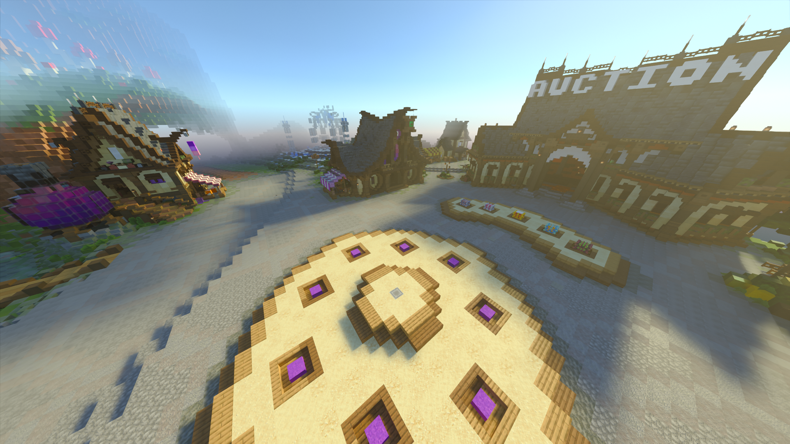

# ➡️ Comment rejoindre Linesia ?

## <mark style="color:purple;">Bonjour à tous !</mark>

Si vous souhaitez rejoindre notre serveur, vous devrez posséder <mark style="color:purple;">Minecraft</mark>, Une version "Crack" du Jeu fonctionne également. Veuillez noter que le serveur ne prend pas en charge la version Java, Il est uniquement disponible sur <mark style="color:purple;">Bedrock</mark> !

Adresse IP : <mark style="color:purple;">**play.linesia.net**</mark> / Version du serveur : <mark style="color:purple;">**1.21.101**</mark>

Si vous éprouvez des difficultés pour vous connecter, n'hésitez pas à ouvrir un ticket sur notre Discord pour obtenir de l'aide car nous avons quelques protections concernant les connexions qui peuvent poser problème.\
\
[https://discord.gg/linesia](https://discord.gg/linesia)

<figure><figcaption></figcaption></figure>

