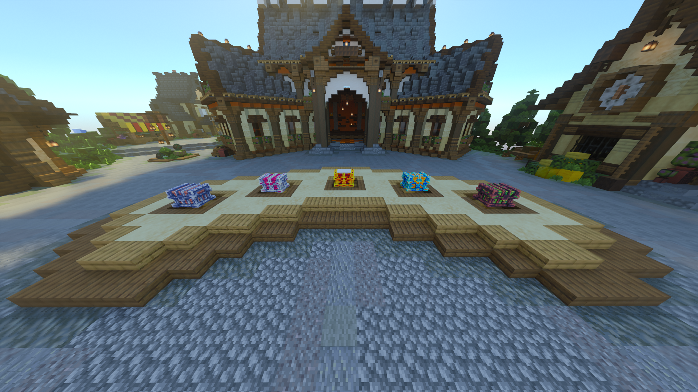

# 📓 Comment voter pour Linesia ?

## Votez pour <mark style="color:purple;">Linesia</mark> et contribuez à notre serveur en gagnant des récompenses en jeu, suivez cette étape simple :

 - Rentrez votre pseudo, faites attention aux majuscules puis cochez la vérification et c'est tout bon ! Faites simplement /vote en Jeu pour recevoir 2 clé vote.\

:warning: - Si vous avez un pseudo a espace, pensez bien a mettre des Guillemets au début et à la fin de votre pseudo; exemple : "Linesia Player"&#x20;

Lien pour voter : [https://minecraftpocket-servers.com/server/114106/vote/](https://minecraftpocket-servers.com/server/114106/vote/)

<figure><figcaption></figcaption></figure>
